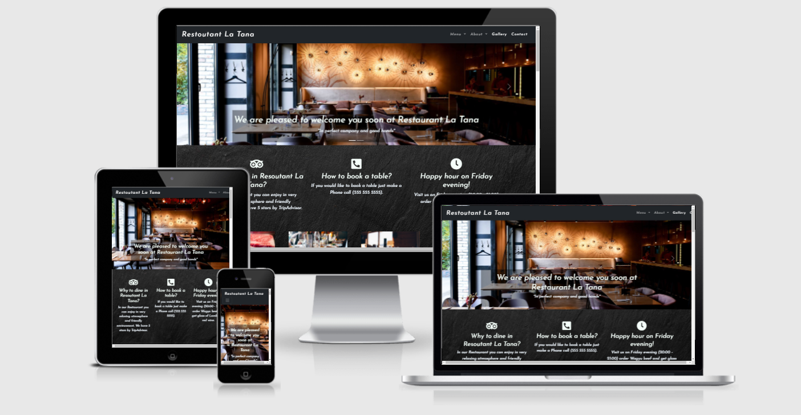
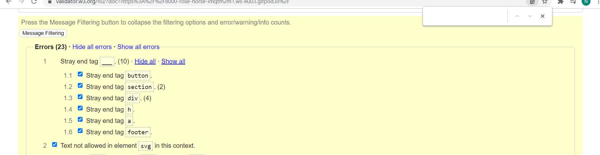
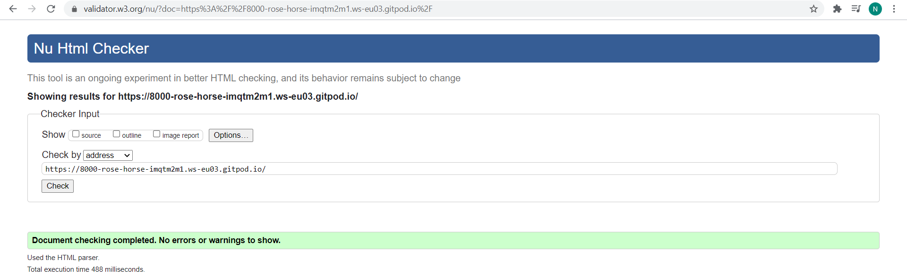
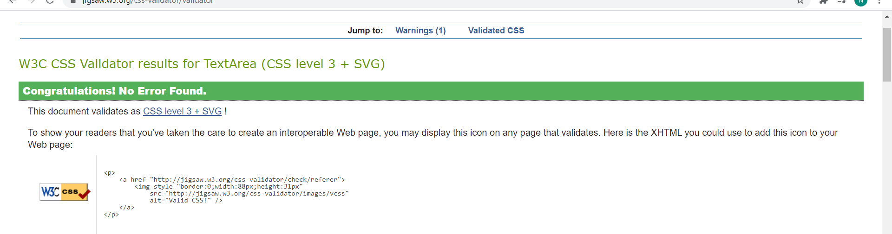
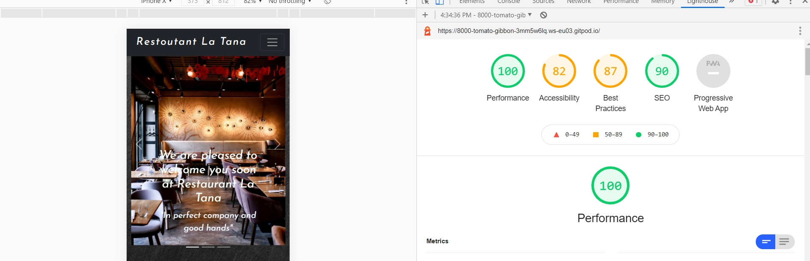
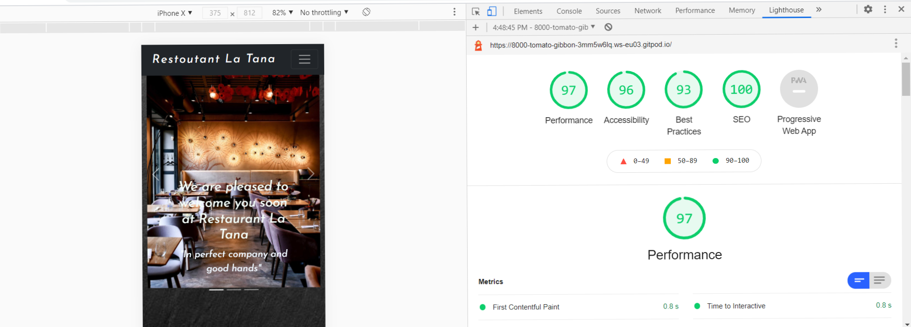
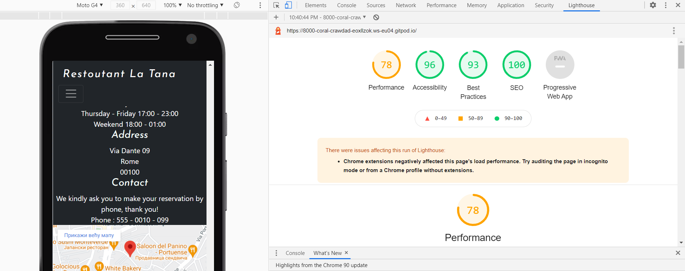
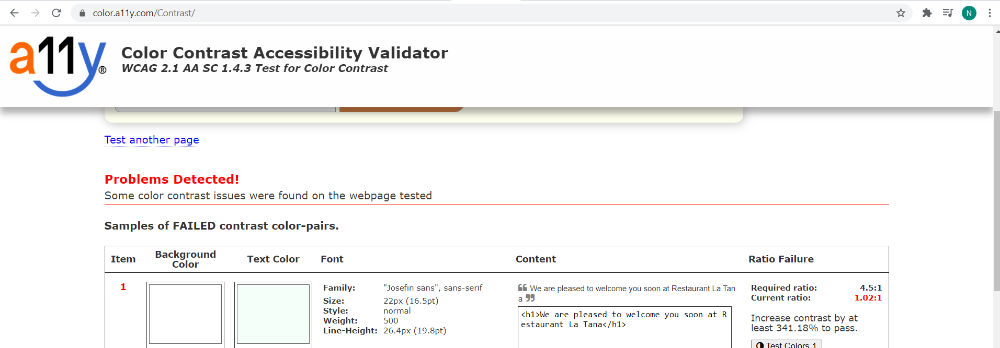
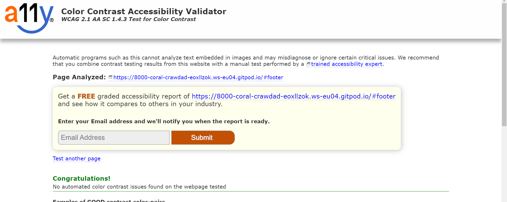

 

- Image produced from [Am I Responsive](http://ami.responsivedesign.is/)
# Restourant La Tana

"La Tana" Restaurant webpage is made to inform a user about information such as opening hours, address, contact number, and location. It also provides information about products which clients can find here such as photos of courses, information about beef and wine.
## UX

### Strategy

### Business objectives
- Promote Restaurant.
- Give a preview of products.
- Invite a user to book a table by phone.
- Inform the user about the location.
- Help a user to understand why is wagyu beef expensive.
- Introduce users with Menu and Winelist.

#### User needs
- As a user, I want to find information about the restaurant,
 such as the restaurant menu, how to book a table, and location.
- As a user, I want to find Contact information easily and quickly.
- As a user, I want Information about the specialties that this restaurant sells, and what is so special about it
- As a user, I want to see photos of the restaurant interior, and courses.
- As a user, I want to easily find Social media links.

### Scope plane:
#### The features that the website should include.
- [x]Landing page, with the hero image.
- [x]Navigation bar with links to Logo, Menu, About, Gallery, Contact.
- [x]Easily findable information for booking a table, location, and opening hours.
- [x]Content about meat.
- [x]Content about wine.
- [x]Footer with location, phone number, opening hours, and Social media links.

### Structure Plane
- When a user opens for the first time website, he will see restaurant images,
 and quick information on how to book a table, and how to find it.
 - In navigation bar, he can find the restaurant menu, winelist, and links to others sections.
 - Menu and winelist will be in PDF format 
 - About section will get the user informed about the specialties of the house, and inform the user about beef and wine.
 - Gallery will contain photos of courses.
 - Information such as Location, Address, Contact, and opening hours will be displayed in two sections:
   - Underneath a hero image
   - in footer 

- User Interface:
     - Navigation should contain:
        - links to Logo, Menu, Contact, About, Gallery.
        - Menu and About will be dropdown menus on all devices.
        - Menu will contain "Winelist", and "Restaurant Menu"
        - About will contain links to sections.
        - on mobile devices nav menu should be a drop-down menu.
    - Footer should contain:
         - Contact information.
         - Opening hours.
         - Address.
        - Location.
        - social media links.
    - About should contain:
        - Wagyu beef section:
            - Information about wagyu.
        - Lambrusco section:
            - Information about wine "Lambrusco".
        - Wagyu steak:
            - Information about wagyu steak.
    - Gallery should contain:
        - Images of restaurant dishes.
    - Contact should contain:
        - Principal information about the restaurant such as Location, Phone number, Opening Hours, and location.

### Skeleton Plane

- I had originally thought about creating a website with a homepage and separate pages, later I decided to put it all on one page to create a better flow.

- [Wireframe Dekstop](assets/wireframes/Dekstop-Restaurant-La-Tana.png)
- [Wireframe Mobile](assets/wireframes/Mobile-Restaurant-La-Tana.png)

### Features List

- [x] Responsive navigation bar.
- [x] Responsive footer.
- [x] Two pages coursel slide with a button.
- [x] Gallery with actual photos of courses.
- [x] Photos from the gallery when hovering over with a description of the actual photo.
- [x] "Menu" dropdown menu linked with PDF.
- [x] About dropdown menu which leads to section.
- [x] Footer with social media icons, google map location.

### Testing User Stories from User Experience
#### As a first-time user, I want to understand the main purpose of the site and learn more about the restaurant.
 - On the top of the website user can find an easily readable, and clean navigation bar.
 - Hero Image has a "Learn More" Call to action button.
 - User can click or scroll down both will lead to the same section.
 - User can easily find information such as how to book and table and location.
#### As a first-time user, I want to easily be able to navigate throughout the site to find restaurant information.
 - User can easily scroll down and return whenever he wants to hero image by clicking on the logo sign.
 - User can find all information about the site by scrolling down or clicking some of the links in the navigation bar which will lead
 to the wanted section.
 - User can find the restaurant menu, and winelist by clicking on the menu button which will open a PDF file.

#### As a First time user I want to learn more about Restaurant and his specialties.
 - User can find quick information when he opens a website,underneath the hero image are quick information about restaurant.
 - User can click About button in the navigation bar which will lead to the wanted section, or just scroll down.
 - User can look in the gallery and explore restaurant courses, when is hovered over the photo it will show description of the photo.
#### As a First time user, I want to how many does it have stars and to see if they are trusted by checking out restaurant on social media.
 - User can find how many stars the restaurant has underneath hero image.
 - User can click on the navigation bar on the Contact button which will lead to footer where he can find social media links.
 ### Testing

#### Testing Responsiveness:

- Every page was opened and viewed using Google Chrome development tool.
 - Each page was viewed on mobile, and desktop displays.

 - [x] Test hero corsel on a landing page on the mobile table, and desktop.
 - [x] Test viewing each section "Wagyu beef", "Lambrusco", "Wagyu stake" on mobile and desktop.
 - [x] Test Gallery.
 - [x] Test Footer

### Testing Writeup
- [x] Test if navigation bar on mobile view became a dropdown menu.
- [x] Test social media links if they open on a new page when clicked.
- [x] Test Navigation-link "Menu: if open PDF on a new page when clicked.
- [x] Test navigation link "About" if it scrolls down to the wanted section.
- [x] Test in "About" dropdown menu if opens the video on a new page.
- [x] Test if by clicking on logo return to hero image.
- [x] Test" learn more" button in hero image if scroll down to the wanted section.
- [x] Test if hero cursel change image when clicked on the arrow button.
- [x] Test if by hovering over an image in section underneath landing page zoom-in.
- [x] Test if on mobile view section underneath the landing page does not display.
- [x] Test if hovering over an image in the gallery displays a description of the image.

### Validation

- I used the [Html Validator](https://validator.w3.org/) to check the Markup and [CSS Validator](https://jigsaw.w3.org/css-validator/) to check the CSS validity of the site
 
  
- Then i fixed errors.

- Css had no errors.

- I constantly tested the code in Chrome Dev Tools and often ran Lighthouse.

- Dekstop
 

- Mobile (I didn't know how to fix be faster,too many photos to load.)

- The [Color Contrast Accessibility Validator](https://color.a11y.com/) was used to test for color.

- I had a problem with the slide photo.

### Technologies Used 

- Html , CSS3

- [Bootstrap v5.0.0-beta3](https://getbootstrap.com/)

- [Adobe-xd](https://www.adobe.com/products/xd.html/)

- [TinyPNG & TinyJPG](https://tinypng.com/)

- [Online-convert](https://image.online-convert.com/convert-to-jpg)

- [Gitpod](https://gitpod.io/workspaces)

- [Font Awesome](https://fontawesome.com/)

- [Google fonts](https://fonts.google.com/)

- [Freeformatter HTML Formatter](https://www.freeformatter.com/html-formatter.html#ad-output)

- [Freeformatter CSS Formatter](https://www.freeformatter.com/css-beautifier.html#ad-output)

### Deployment

- This site was deployed to GitHub pages. The steps to deploy are as follows:
    - In the GitHub repository, navigate to the Settings tab.
    - From the source section drop-down menu, select the Main Branch.
    - Once the main branch has been selected, the page will be automatically refreshed with a detailed ribbon
      displayed to indicate the successful deployment.
- Live link [RestourantLaTana](https://maxapn98.github.io/RestaurantLaTana/)
### Credits

- Gallery inspired from [Freecodecamp](https://www.freecodecamp.org/news/how-to-create-an-image-gallery-with-css-grid-e0f0fd666a5c/)

- Coursel exemple used [Bootstrap v5.0.0 ](https://getbootstrap.com/docs/5.0/examples/)

 #### Media
- Photos are taken from [Unsplash](https://unsplash.com/s/photos/restaurant?orientation=landscape)

 