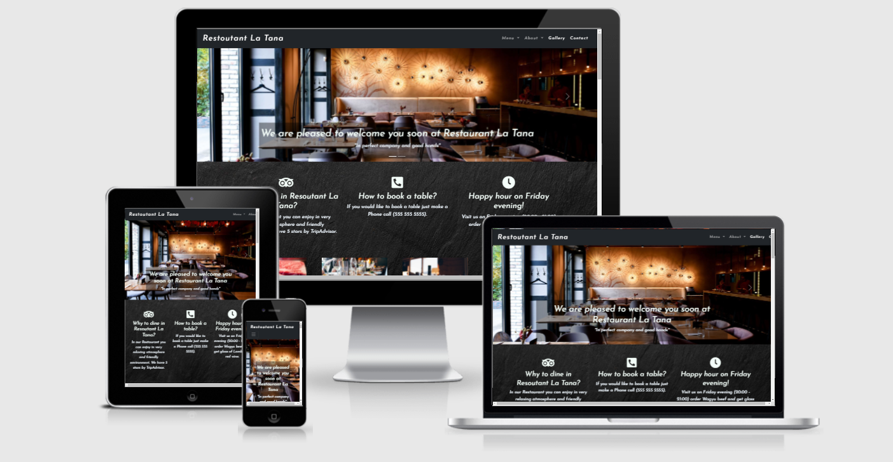 

* Image produced from [Am I Responsive](http://ami.responsivedesign.is/)
<h1>Overview</h1>

This Restaurant is for Wagyu beef lovers and those who appreciate exquisite cuisine, and wine. Based on experiences in this work area, this website will be perfect for every visitor. It's very simple to navigate and get overview over its Wagyu beef specialist, also u can get information about wine list, location,menu, opening hours.

<h1>Strategy</h1>

* This website is created for "Restourant La Tana" so the guests can get fast information where to find it and eventually to book a table.

* The main aims of this website is to inform new costumers about menu,location, opening hours, to present dishes, and to teach costumers about Wagyu beef.
 
 * A user can learn about Restourant most exquisite offers.

<h1>Structure</h1>

* I decided to create a single-page website, In the navigation bar you can find fast way to see a menu (food menu and wine list) then About (Wagyu stake, What is so special about wagyu cattle,interesting facts about most paired wine with Wagyu stake),Gallery (if guest is interested to see which  dishes are made in Restaurant) and Contact (contact is only by call,like in real life this makes things much easier for guests and stuff). Navigation bar include links that will take guest to desired section. I decided to fill whole website with presentation and photos to promote restaurant so guests can get informed about specialties of this place.

<h1>Skeleton</h1>

*  I had originally thought about creating a website with a homepage and separate pages,later I decided to put all in one page to create a better flow. (wireframes are different from the original wireframe, but they share same idea.)

 
 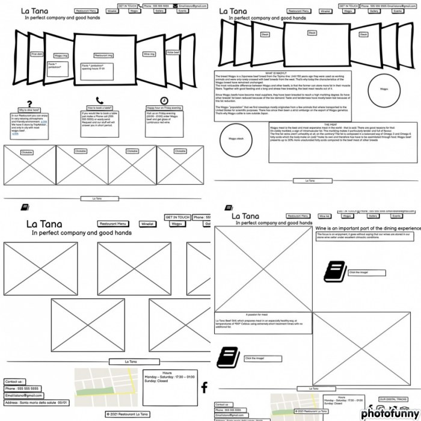 
 
 <h1>Surface</h1>
 
 * I wanted the design to be clean and elegant.I didn't want to mix too many colors because of this reason, I thought black and white are the most elegant and clean.  Website contains many photos for marketing reasons.

  <h1>Features</h1>

  <h3>The Navigation bar includes:</h3>

  * 4 buttons , 2 of then are dropdown menus 
  
  1. <strong> Menu</strong> dropdown menu contain contain "Restaurant menu" ,and "Winelist" buttons ,clicking on them will lead to pdf..
  1. <strong>About</strong> also a dropdown menu who contain  "Wagyu Beef" , "Lambrusco" and "Wagyu steak" buttons which will lead desired section.
  1. <strong>Gallery</strong> button lead to Gallery seciton.
  1. <strong>Contact</strong> button lead to footer which contain Phone number, Address, Location and Opening hours.

   <h3>Coursel slide</h3> 

   * Contains two slides one is Restourant image and other is Wagyu image which provided with <strong>Learn more</strong> button.

   <h3>Reasons section</h3>

  * Three reasons why  potential clients should visit this Restourant. 
  1. "Happy hour"
  1. "Phone number" for table reservetion 
  1. "Why to dine here"

  <h3>Wagyu section</h3> 
  
  * "Lambrusco" section and "Wagyu meat" section are made in similar way, so guest can get informed about "Wagyu meat what is it?" "Why it costs so much ?" and best wine to pair with beef.

  <h3>Gallery</h3> 
  
  * Is provided with actual photos of dishes from menu. When visitor hover over the photo he can see what is in photo description.

<h3>Footer</h3> 

* Contains "Address", "Contact" , "Opening hours" ,Social Media icons and Location on google maps.

<h1>Technologies Used</h1>

* Html , CSS3

* [Bootstrap v5.0.0-beta3](https://getbootstrap.com/) 

* [Balsamiq](https://balsamiq.com/wireframes/?gclid=CjwKCAjwhMmEBhBwEiwAXwFoEevIzP_OWBercronmmZHWv2kqbbe77PxZjhASJmZxkn6KOwSNqtIBxoC9AsQAvD_BwE)

* [TinyPNG & TinyJPG](https://tinypng.com/)

* [Online-convert](https://image.online-convert.com/convert-to-jpg)

* [Gitpod](https://gitpod.io/workspaces)

* [Font Awesome](https://fontawesome.com/)

* [Google fonts](https://fonts.google.com/)

* [Freeformatter HTML Formatter](https://www.freeformatter.com/html-formatter.html#ad-output)

* [Freeformatter CSS Formatter](https://www.freeformatter.com/css-beautifier.html#ad-output)

<h1>Validation</h1>

* I used the [Html Validator](https://validator.w3.org/) to check the Markup and [CSS Validator](https://jigsaw.w3.org/css-validator/) to check the CSS validity of the site
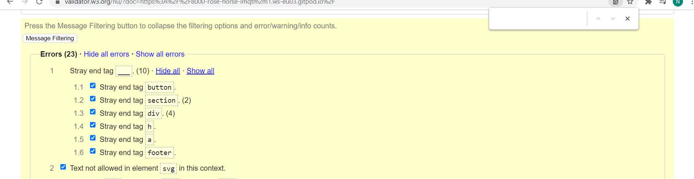 
  
* then i fixed errors.
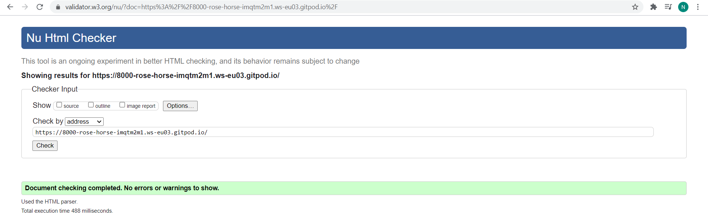

* css had no errors.
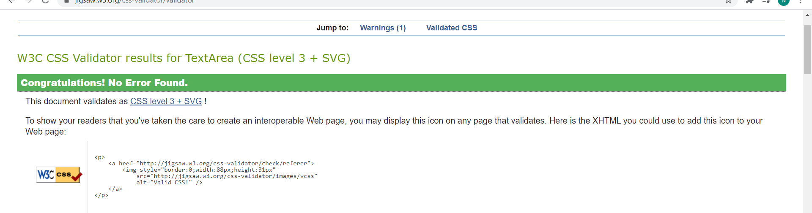

* I constantly tested the code in Chrome Dev Tools and often ran Lighthouse

 1. Dekstop
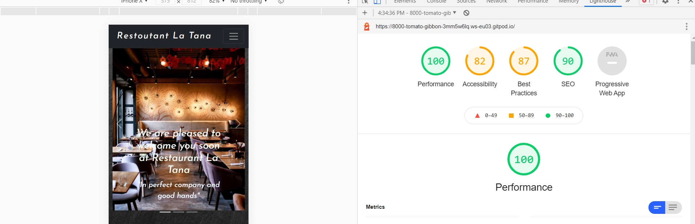 
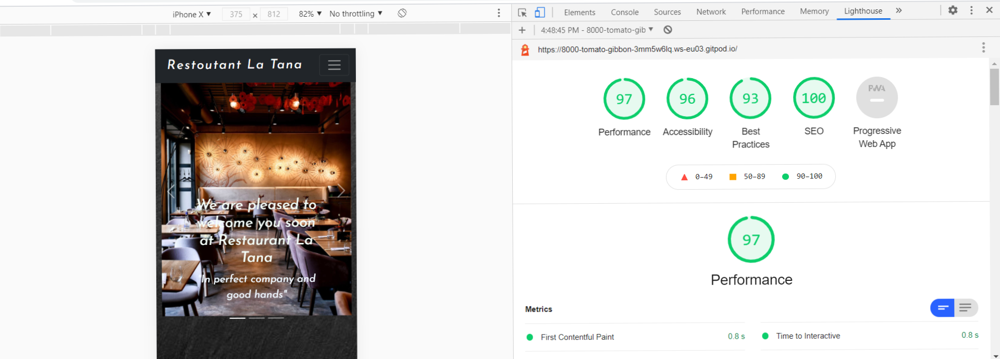

1. Mobile (I didn't know how to fix be faster,too many photos to load.)
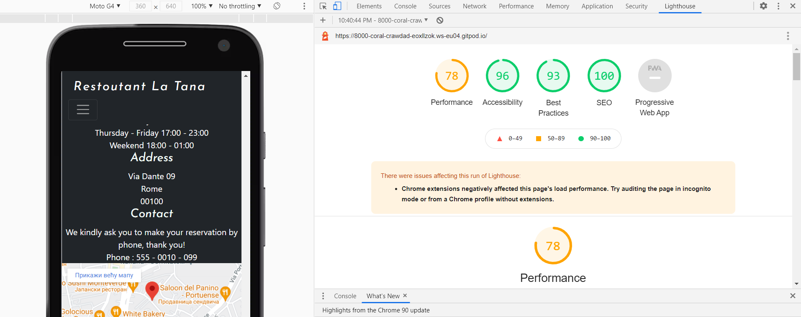

* The [Color Contrast Accessibility Validator](https://color.a11y.com/) was used to test for colour.
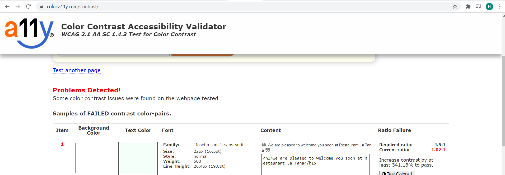
* I had problem with slide photo.
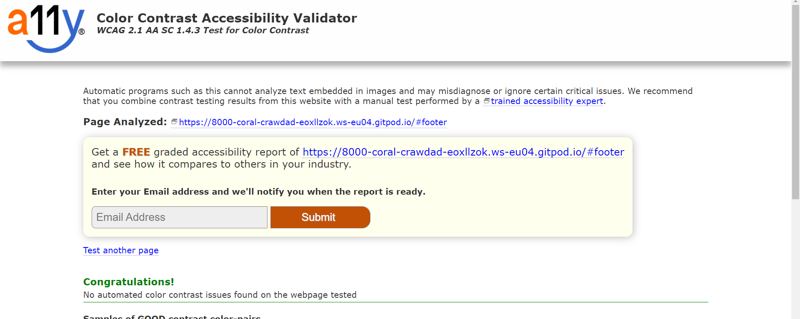

<h1>Deployment</h1>

* This site is hosted using GitHub pages,deployed from master branch.

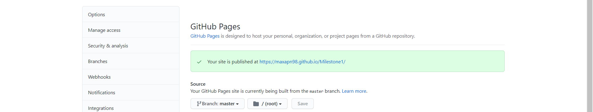
 
 * I deployed my website from the GitHub repository to GitHub Pages.

<h1>Credits</h1>

* Gallery inspired from [Freecodecamp](https://www.freecodecamp.org/news/how-to-create-an-image-gallery-with-css-grid-e0f0fd666a5c/)

* Coursel exemple used [Bootstrap v5.0.0 ](https://getbootstrap.com/docs/5.0/examples/)
  <h2>Media</h2>

*  80% photos are taken from [Unsplash](https://unsplash.com/s/photos/restaurant?orientation=landscape)
 <h2>Content</h2>

*  Some content are then from [Wagyu in Alto adige](https://www.wagyu.bz.it/?l=en)

*  Lambrusco section is translated from [Lambrusco](https://www.lambrusco.com/)

* Menu is inspired from Restourant where i worked before.

<h1>Features Left to Implement</h1>

* I wanted to provide someway of table reservation online but i didn't have idea what can be comfortable for stuff and guest like in real life.

* When you click on gallery photo to go full screen, in this case I resized photos and this wasn't possible because they lost resolution.